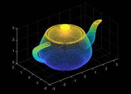
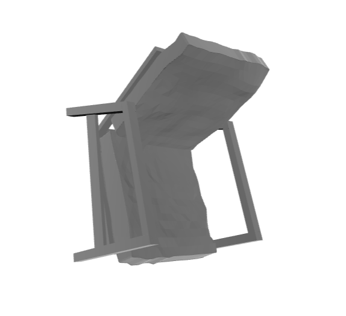
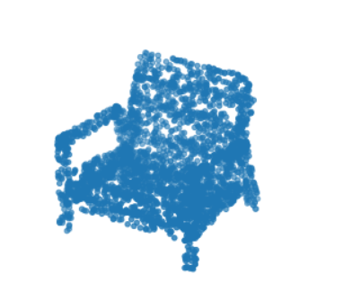
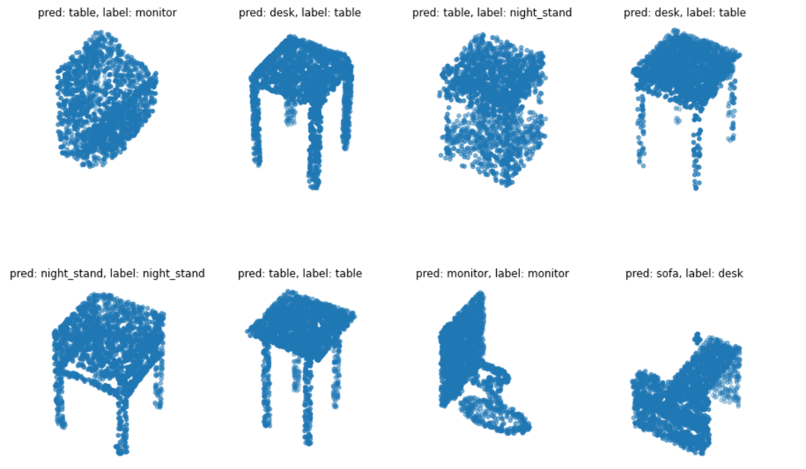

# PointCloud3D

In this project, I implemented Point Cloud 3D classification.
A point cloud is a discrete set of data points in space. The points may represent a 3D shape or object. Each point position has its set of Cartesian coordinates. Point clouds are generally produced by 3D scanners or by photogrammetry software, which measure many points on the external surfaces of objects around them.

</img> 

## Language
The project is written in Python.

## Images
</img> 
</img> 
</img> 

## Contributing
Pull requests are welcome. For major changes, please open an issue first to discuss what you would like to change.

Please make sure to update tests as appropriate.

## License
[ Apache-2.0 License](http://www.apache.org/licenses/)
